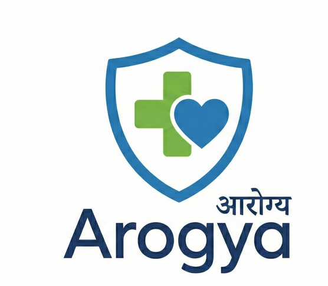

# Arogya - Smart Hospital Management System

**Arogya** is a comprehensive, full-stack Hospital Management System designed to streamline hospital operations, including Patient Registration, Queue Management (OPD), Doctor Consultations, Diagnostic/Lab Workflows, and Patient Tracking via QR Codes.



## 🚀 Key Features

*   **Role-Based Access Control (RBAC)**: Secure dashboards for Admins, Doctors, Receptionists, and Lab Technicians.
*   **Smart Queue Management**:
    *   **Live OPD Queue**: Real-time tracking of patient tokens.
    *   **Emergency Overrides**: Doctors can flag patients as "Emergency" to skip queues.
    *   **Serial Token Enforcement**: Prevents queue jumping logic unless authorized.
*   **Patient Experience**:
    *   **QR Code Integration**: Patients scan a QR code to view their live status and reports.
    *   **Mobile-Friendly Patient Dashboard**: No login required for patients (QR-based access).
*   **Doctor Station**:
    *   Digital Prescriptions (Medicines & Tests).
    *   Patient History View.
    *   One-click Referrals to Lab.
*   **Diagnostic Lab Hub**:
    *   Technicians receive real-time test requests (X-Ray, Blood Test, MRI, etc.).
    *   **Scan-to-Verify**: Technicians must scan patient QR to mark tests as complete.
    *   Filterable Workqueues.

## 🛠️ Tech Stack

*   **Frontend**: React.js (Vite), Tailwind CSS, Lucide Icons, Axios.
*   **Backend**: Node.js, Express.js, Socket.io (Real-time updates).
*   **Database**: SQLite (via Prisma ORM) - *Easily switchable to PostgreSQL/MySQL*.
*   **Tools**: BCrypt (Security), JWT (Auth), QRCode.js.

## 📦 Installation & Setup

### Prerequisites
*   Node.js (v18+)
*   NPM or PNPM

### 1. Clone the Repository
```bash
git clone https://github.com/muzamilaminmir/Arogya.git
cd Arogya
```

### 2. Backend Setup
```bash
cd server
npm install

# Initialize Database
npx prisma migrate dev --name init
npx prisma db seed # (Optional) Seeds default users like Admin/Doctors

# Start Server
npm run dev
# Server runs on http://localhost:5000
```

### 3. Frontend Setup
```bash
cd ../client
npm install

# Start Frontend
npm run dev
# App runs on http://localhost:5173
```

## 🔐 Default Credentials (if seeded)
*   **Admin**: `admin` / `password123`
*   **Reception**: `reception` / `password123`
*   **Doctor**: `doctor` / `password123`
*   **Lab Tech**: `lab` / `password123`

## 📖 Usage Guide

1.  **Reception**: Log in -> Register a new patient -> Print QR Slip.
2.  **Patient**: Scan QR Code -> View "Waiting No. 5".
3.  **Doctor**: Log in -> "Start Consultation" -> Prescribe -> "Mark Emergency" (Optional) -> Complete.
4.  **Lab**: Log in -> View Pending Tests -> Scan Patient QR -> "Process" & Complete.

## 🤝 Contributing

Contributions are welcome! Please check the [CONTRIBUTING.md](CONTRIBUTING.md) file for guidelines.

## 📄 License

This project is licensed under the MIT License - see the [LICENSE](LICENSE) file for details.
